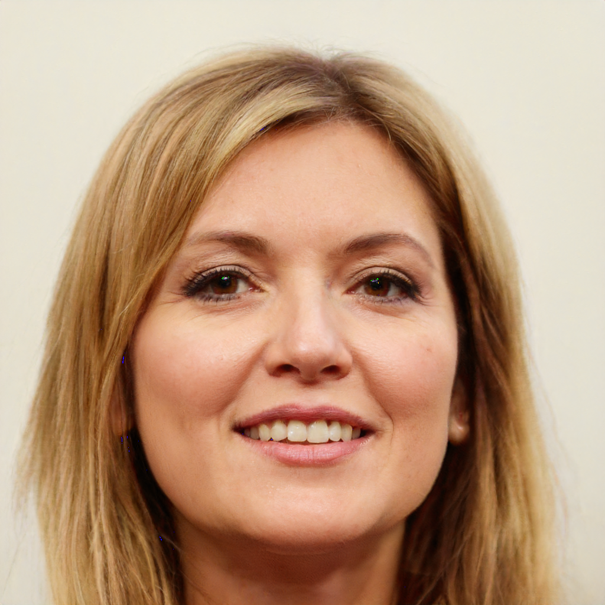
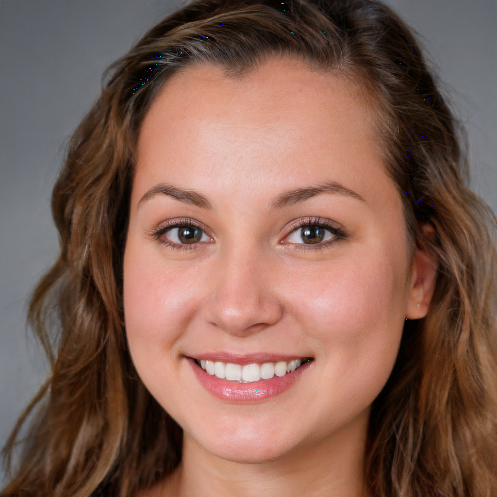
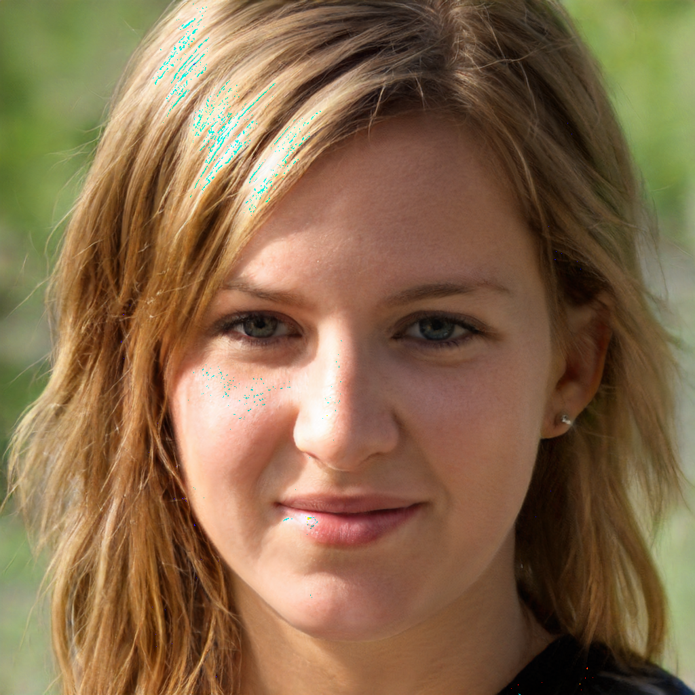
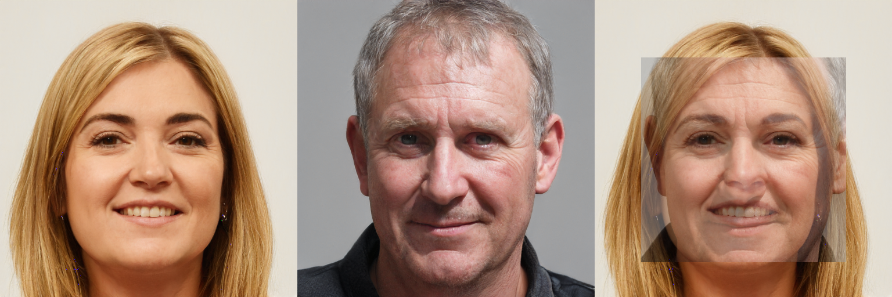
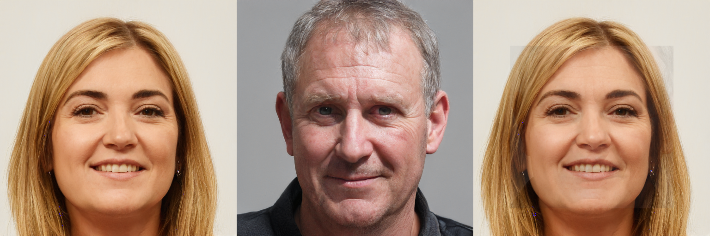

# StyleGAN2 Face Manipulation Project

Проект демонстрирует генерацию изображений лиц с помощью StyleGAN2-ADA, интерполяцию между ними и замену лиц (face-swap) с разной интенсивностью.

---

## Генерация изображений

С помощью StyleGAN2 было сгенерировано **10 случайных лиц**.  
Результаты сохраняются в папке `results/` с именами `gen_0.png ... gen_9.png`.

Пример:

---

## Интерполяция между изображениями

Для двух выбранных latent-векторов было построено **плавное превращение одного лица в другое** (интерполяция).  

Пример интерполяции:

---

## Замена лиц (Face-Swap)

### Шаги:

1. **Открытие и нормализация изображений**  
   Используем `PIL` и `torchvision.transforms` для приведения к размеру 512×512 и нормализации в диапазон [-1,1].

2. **Инициация функции потерь**  
   Используются:  
   - `MSELoss` — L2 loss  
   - `LPIPS` — перцептуальная потеря  

3. **Получение стартового latent-вектора**  
   Возможные варианты:  
   - средний вектор генератора  
   - e4e энкодер (инверсия изображения в latent space)  
   - интерполяция между латентными векторами  

4. **Оптимизация latent-вектора**  
   Используется Adam optimizer для минимизации выбранных функций потерь, чтобы результат максимально соответствовал источнику.

5. **Склеивание результатов**  
   Итоговые изображения объединяются в **одну картинку**, где слева — target, в центре — source, справа — результат face-swap.

---

### 3.1 Сильная замена лица (ярко видно изменения)

  

Файл: `final_face/final_face_strong.png`

---

### 3.2 Полумягкая замена лица (умеренные изменения)

Значение `alpha = 0.15` — 15% признаков source, 85% target.  

  

Файл: `final_face/final_face_swap_half.png`

---

### 3.3 Обычная замена лица (по умолчанию, alpha = 0.5)

  

Файл: `final_face/final_face_swap.png`

---

## Используемые библиотеки

- `torch`, `torchvision` — генерация и обработка изображений
- `StyleGAN2-ADA-PyTorch` — генератор лиц
- `LPIPS` — перцептуальная потеря для face-swap
- `PIL` и `matplotlib` — отображение и сохранение изображений
- `OpenCV` — создание маски лица

